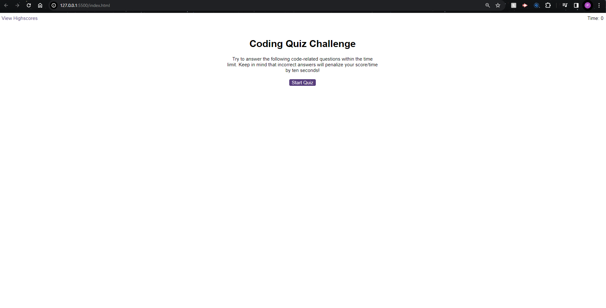
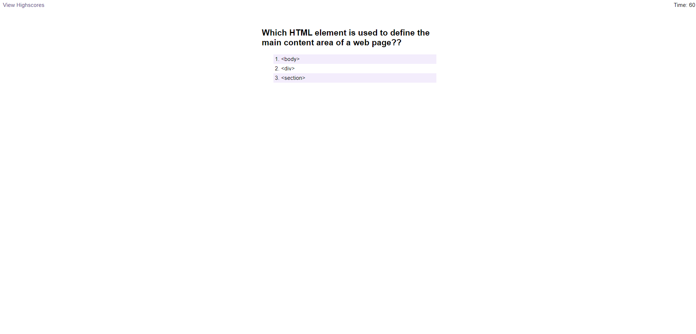
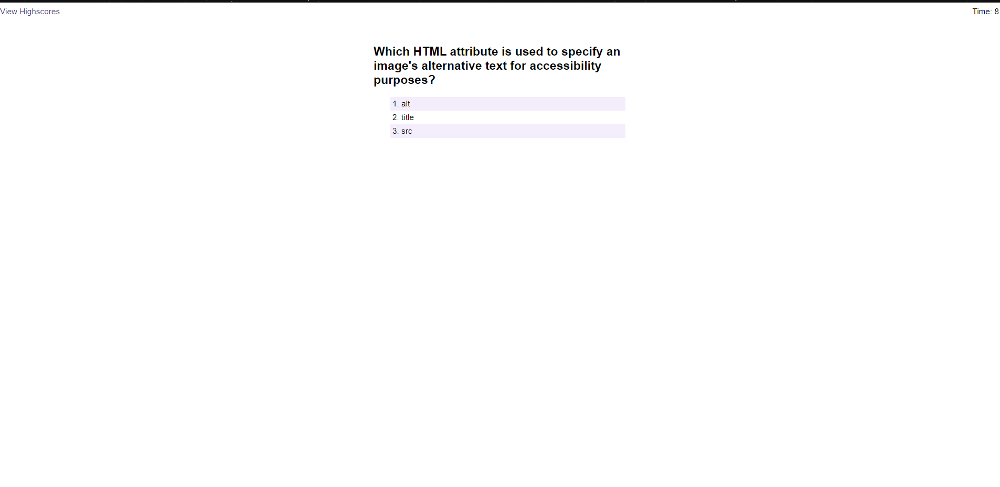

# code-quiz

# Overview
This project challenges you to create a timed, multiple-choice coding quiz that tracks scores and player initials. It tests your skills in JavaScript, HTML, CSS, and potentially web APIs for data storage.

# Getting Started
Prerequisites:
- A code editor 
- Basic understanding of JavaScript, HTML, and CSS

# Installation:
- Download and unzip the starter code: [link to starter code]
- Navigate to the project directory

# Preview 
- Below are example screenshots of what the quiz looks like as per what is required from the challenge; if you select the wrong option you get 10 seconds taken of the clock (your time) if you get it correct time stays the same and you have more time to complete the entire quiz.  

# Author
Paul T